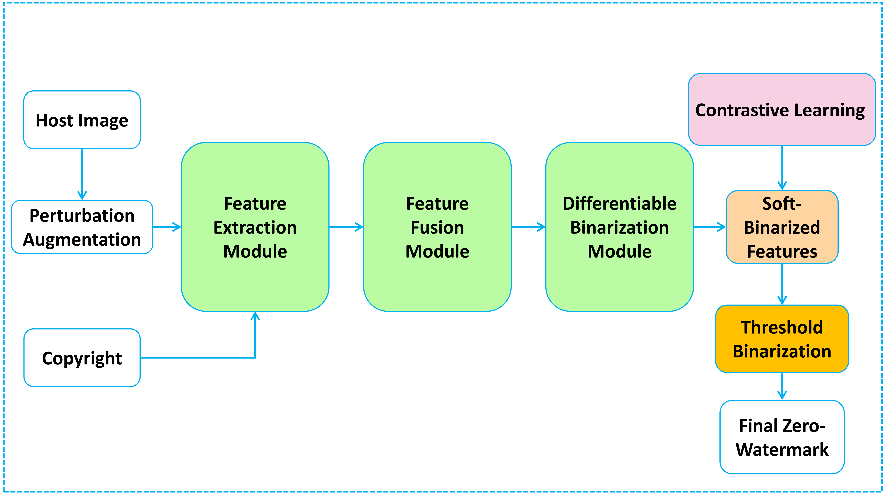

# ConZWNet-V2

This repository contains the implementation of **ConZWNet-V2**, a pipeline-wide contrastive learning framework for robust and discriminative image zero-watermarking.

## 📄 Paper

**Title:**  
**ConZWNet-V2: Going Beyond Intermediate Features with Contrastive Learning over the Complete Zero-Watermarking Pipeline**

**Authors:**  
Deyu Tong, Weilong Kong, Bingdao Huang, Yifan Liu, Na Ren

**Status:**  
Manuscript under review. The final publication link and BibTeX entry will be added after publication.

### Abstract

Zero-watermarking protects image copyright without modifying the host image. ConZWNet-V2 addresses a structural limitation of existing deep learning-based methods: contrastive learning is often applied only to intermediate backbone features, while downstream feature fusion and binarization remain outside the contrastive objective. ConZWNet-V2 instead applies contrastive learning directly to the final soft-binarized zero-watermark representation, jointly optimizing feature extraction, feature fusion, and differentiable binarization. The framework consists of ResNet-50 feature extraction, iAFF feature fusion, Sigmoid-based differentiable binarization, and MoCo-V2-based contrastive learning.

---

## 1. Introduction

ConZWNet-V2 is designed around a simple observation: the representation optimized during training should match the representation that ultimately determines the deployed zero-watermark.

The framework therefore applies the InfoNCE objective directly to the **final L2-normalized soft-binarized watermark representation**, rather than to an isolated intermediate backbone feature.


<p align="center">
  
</p>

<p align="center">
  <b>Overview of the proposed ConZWNet-V2 framework.</b>
</p>

The complete pipeline contains four stages:

1. **ResNet-50 feature extraction**
   - Host and copyright images are processed by two ResNet-50 branches.
   - Stage-4 feature maps are projected from 2048 channels to 768 channels.

2. **iAFF feature fusion**
   - Host and copyright features are fused using Iterative Attentional Feature Fusion (iAFF).
   - Two rounds of MS-CAM-based attention refine the heterogeneous feature streams.

3. **Sigmoid-based differentiable binarization**
   - Global average pooling and a two-layer MLP produce a 1024-dimensional logit vector.
   - Sigmoid produces a continuous representation `v_soft`.
   - The L2-normalized representation is used for contrastive learning.
   - During zero-watermark generation, `v_soft` is thresholded at `0.5` to obtain 1024 binary bits.

4. **MoCo-V2 contrastive learning**
   - The query encoder and momentum-updated key encoder form positive pairs.
   - A dynamic queue stores negative key representations.
   - InfoNCE is applied directly to the final soft-binarized representation.

### Main contributions

- **Pipeline-wide contrastive optimization:** contrastive supervision propagates through feature extraction, fusion, and differentiable binarization.
- **Differentiable binarization:** a Sigmoid-based bridge enables continuous optimization while retaining fixed-threshold discrete watermark generation.
- **Robustness and discriminability:** experiments show a minimum mean BCR above 0.96 while host-image and copyright-image NC remain below 0.40.

> The current implementation uses standard **MoCo-V2 / InfoNCE**. The deprecated B-NCE implementation is not included.

---

## 2. Requirements

Key dependencies are listed in `requirements.txt`:

- PyTorch
- torchvision
- timm
- NumPy
- Pillow
- OpenCV
- tqdm
- matplotlib

Install them with:

```bash
pip install -r requirements.txt
```

A CUDA-capable GPU is strongly recommended for training.

---

## 3. Dataset

### Host images

The experiments use **MiniImageNet** as the host-image dataset:

- Training: **38,400** images
- Validation: **9,600** images
- Test: **12,000** images
- Total: **60,000** images

### Copyright images

The manuscript uses **200 university-logo images** collected from publicly accessible Internet sources as copyright images.

### Expected directory structure

```text
Conzwnet-v2/
├── Mini-ImageNet-Dataset/
│   ├── train/
│   ├── val/
│   └── test/
├── copyright/
│   ├── image_001.png
│   ├── image_002.png
│   └── ...
├── train.py
├── evaluate_robustness.py
├── evaluate_discriminability.py
├── modules/
└── utils/
```

The host-image folders are scanned recursively, so class subdirectories are supported.

The training roots can also be overridden with environment variables:

```bash
export MINI_IMAGENET_ROOT=/path/to/Mini-ImageNet-Dataset
export COPYRIGHT_ROOT=/path/to/copyright
python train.py
```

---

## 4. Train the ConZWNet-V2 Model

Run:

```bash
python train.py
```

### Current public-script defaults

| Hyperparameter | Value |
|---|---:|
| Image size | 224 |
| Batch size | 96 |
| Epochs | 140 |
| Optimizer | SGD |
| Learning rate | 1e-4 |
| Momentum | 0.9 |
| Weight decay | 1e-4 |
| Watermark dimension | 1024 |
| MoCo queue size | 4096 |
| MoCo momentum | 0.999 |
| Temperature | 0.07 |
| Arnold iterations | 10 |
| Default seed | 42 |

The default checkpoint is saved to:

```text
results/seed_42/weights.pth
```

Training curves and logs are also written under the corresponding seed directory.

### Manuscript training configuration

The manuscript reports three independent runs using seeds **42, 43, and 44**, with:

- Epochs: **140**
- Initial learning rate: **1e-4**
- SGD momentum: **0.9**
- Weight decay: **1e-4**
- MoCo queue size: **4096**
- MoCo momentum: **0.999**
- Temperature: **0.07**
- AMP: enabled

To reproduce the manuscript configuration exactly, change the corresponding values in `train.py` and run the three seeds independently.

---

## 5. Evaluation

### 5.1 Robustness

Robustness is evaluated using **Bit Correct Rate (BCR)**:

```bash
python evaluate_robustness.py
```

The evaluator loads:

```text
results/seed_42/weights.pth
```

The default discrete zero-watermark is obtained using a fixed threshold of `0.5`.

### 5.2 Discriminability

Discriminability is evaluated using **Normalized Correlation (NC)**:

```bash
python evaluate_discriminability.py
```

Two settings are evaluated:

- **Host-image discriminability:** copyright image fixed, host image varied.
- **Copyright-image discriminability:** host image fixed, copyright image varied.

The evaluation uses 10 anchors selected with evaluation seed 42.

---

## 6. Results

Results below are taken from the current manuscript and are reported as **mean ± sample standard deviation across three independent runs using seeds 42, 43, and 44**.

### 6.1 Robustness

Higher BCR is better.

| Attack Type | BCR (mean ± SD) |
|---|---:|
| No Attack | **1.0000 ± 0.0000** |
| Rotation (180°) | **0.9861 ± 0.0033** |
| Random Crop (75%) | **0.9663 ± 0.0099** |
| Corner Crop (Left-Bottom, 12.5%) | **0.9995 ± 0.0003** |
| Salt & Pepper Noise (0.10) | **0.9926 ± 0.0033** |
| Gaussian Noise (0.10) | **0.9806 ± 0.0080** |
| Median Filter (11×11) | **0.9941 ± 0.0027** |
| Gaussian Filter (11×11) | **0.9942 ± 0.0037** |
| Mean Filter (11×11) | **0.9909 ± 0.0061** |
| JPEG Compression (Q=20) | **0.9964 ± 0.0021** |
| Resize Attack (0.50) | **0.9963 ± 0.0022** |

The manuscript reports an **overall BCR of 0.9918 ± 0.0026**. The most challenging evaluated condition is 75% random cropping, for which ConZWNet-V2 still achieves **0.9663 ± 0.0099** BCR.

### 6.2 Discriminability

Lower NC is better.

| Metric | NC (mean ± SD) |
|---|---:|
| Host-image Discriminability | **0.3316 ± 0.0201** |
| Copyright-image Discriminability | **0.3431 ± 0.0246** |

Both values remain below 0.40, indicating that the generated zero-watermarks remain well separated when either the host image or the copyright image changes.

### 6.3 Main ablation results

#### Backbone

| Metric | ResNet-50 | MambaOut-S | ConvNeXt-S |
|---|---:|---:|---:|
| Minimum BCR ↑ | **0.9663 ± 0.0099** | 0.8855 ± 0.0022 | 0.8934 ± 0.0112 |
| Host-image NC ↓ | 0.3316 ± 0.0201 | 0.2672 ± 0.0250 | **0.2310 ± 0.0125** |
| Copyright-image NC ↓ | **0.3431 ± 0.0246** | 0.5274 ± 0.0306 | 0.5545 ± 0.0103 |

#### Contrastive learning framework

| Metric | MoCo-V2 | SimCLR |
|---|---:|---:|
| Minimum BCR ↑ | **0.9663 ± 0.0099** | 0.9572 ± 0.0050 |
| Host-image NC ↓ | **0.3316 ± 0.0201** | 0.4179 ± 0.0201 |
| Copyright-image NC ↓ | **0.3431 ± 0.0246** | 0.4958 ± 0.0058 |

#### Feature fusion

| Metric | iAFF | Simple Concat |
|---|---:|---:|
| Minimum BCR ↑ | **0.9663 ± 0.0099** | 0.9290 ± 0.0043 |
| Host-image NC ↓ | **0.3316 ± 0.0201** | 0.6205 ± 0.0101 |
| Copyright-image NC ↓ | **0.3431 ± 0.0246** | 0.6778 ± 0.0050 |

#### Differentiable binarization

| Metric | Sigmoid | Tanh | STE |
|---|---:|---:|---:|
| Minimum BCR ↑ | **0.9663 ± 0.0099** | 0.8111 ± 0.0056 | 0.8417 ± 0.0090 |
| Host-image NC ↓ | 0.3316 ± 0.0201 | **0.2821 ± 0.0038** | 0.3050 ± 0.0137 |
| Copyright-image NC ↓ | 0.3431 ± 0.0246 | **0.2451 ± 0.0148** | 0.3394 ± 0.0120 |

Although Tanh and STE can produce lower NC in some cases, Sigmoid provides the strongest robustness and the best overall balance between robustness and discriminability in the evaluated setting.

---

## 7. Repository Structure

```text
Conzwnet-v2/
├── README.md
├── LICENSE
├── requirements.txt
├── train.py
├── evaluate_robustness.py
├── evaluate_discriminability.py
├── modules/
│   ├── __init__.py
│   ├── ablation_core.py
│   ├── distinguishability_utils.py
│   └── robustness_utils.py
└── utils/
    ├── __init__.py
    ├── augmentations.py
    ├── bit_metrics.py
    ├── dataloader.py
    └── nc_metrics.py
```

---

## 8. Reproducibility Notes

- MiniImageNet, the 200 copyright images, and trained checkpoints are not included in this repository.
- `train.py` currently defaults to seed 42. Change the seed to reproduce seeds 43 and 44.
- The current code uses `pretrained=False` for ResNet-50.
- Evaluation scripts load the query encoder from the MoCo checkpoint and ignore queue/key-encoder entries.
- The current copyright-image training loader uses `batch_size=96` with `drop_last=True`; therefore, enough copyright images are required to form at least one full copyright batch.
- The public script defaults and the exact manuscript training configuration are explicitly distinguished above.

---

## Citation

If you use this repository in your research, please cite:

> Deyu Tong, Weilong Kong, Bingdao Huang, Yifan Liu, and Na Ren.  
> **ConZWNet-V2: Going Beyond Intermediate Features with Contrastive Learning over the Complete Zero-Watermarking Pipeline.**

The final journal citation and BibTeX entry will be added after publication.

---

## License

This project is licensed under the MIT License. See [LICENSE](LICENSE) for details.
